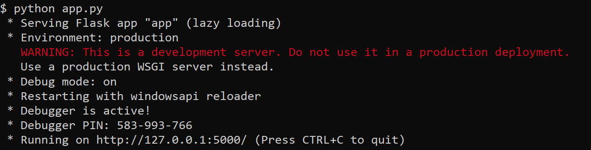
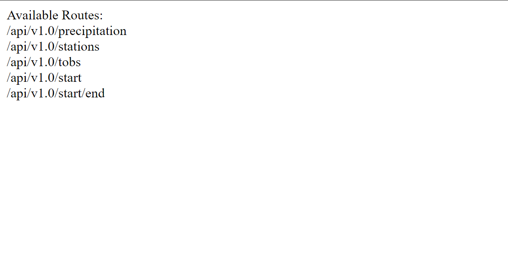

# Python SQLAlchemy Climate Analysis
This repo uses Python3 and the SQLAlchemy library to do a basic climate analysis and data exploration of Honolulu, Hawaii climate data measurements existing in an SQLite database. It also has a Flask API that can run queries and return JSON data from our database.


## **Getting Started**
#
**These instructions will get you a copy of the project up and running on your local machine for developement and testing purposes. See [Deployment](#Deployment "Goto **Deployment**") for notes on how to deploy the project on a live system.**


## **Prerequisites**
#
**What things you need to install the software and how to install them.**

* GitHub Account

* Python
    * Libraries: pandas, numpy, matplotlib, SQLAlchemy, DateTime, and SciPy

* Git

## **Installing**
#
**A step by step series of examples that tell you how to get a development environment running.**

*We are using Python and Jupyter Notebook so those two should be installed. I recommend using [Anaconda](https://docs.anaconda.com/anaconda/user-guide/index.html) and [Conda](https://docs.conda.io/projects/conda/en/latest/user-guide/) (both are free) to create a virtual environment if you currently don't have either one installed. Follow the instructions below to set these up on a PC. For additional information on Python Virtual Environments click [here](https://docs.python.org/3/tutorial/venv.html).*

**Python**
* Download and install [Anaconda](https://www.anaconda.com/products/individual)
    * Click download and select the latest Python version.
    * Open the installer and follow the instructions to complete the installation.
* Verify [Conda](https://docs.conda.io/projects/conda/en/latest/user-guide/) is installed by entering the following command into your terminal window:
```
conda --version
```
* Update Conda by running the following command into your terminal window:
```
conda update conda
```

* From your terminal run the following code to install [pip](https://pip.pypa.io/en/stable/):
```
conda install pip
```
* *pip is the package installer for Python. This will come in handy for the Python libraries we will be installing.*
    * *Python is infamous for its [libraries](https://en.wikipedia.org/wiki/Category:Python_(programming_language)_scientific_libraries).*

**Git**
* Download a free version control system called [Git](https://git-scm.com/).
    * *Git is a great way to interact with [GitHub](https://github.com/). You are currently viewing this repository on GitHub so I'm assuming you already have an account. If not, Sign up now.*

    * Go through the installation until you get to the "Choosing the default editor used by Git".
        * Select "Use Visual Studio Code as Git's default editor" if you don't already have a code editor installed. 
            * Download Visual Studio Code [here](https://code.visualstudio.com/).
    * Set up your user name in Git by following the instructions [here](https://docs.github.com/en/get-started/getting-started-with-git/setting-your-username-in-git).
    * Set up your user email address in Git by following the instructions [here](https://docs.github.com/en/github/setting-up-and-managing-your-github-user-account/managing-email-preferences/setting-your-commit-email-address).
    * Set up your SSH keys in Git by following the steps in this [video](https://www.youtube.com/watch?v=Nf2Ggt3Mwgk).

**Python Libraries**

*Click the library name for instructions on how to download.*
* [pandas](https://pandas.pydata.org/docs/getting_started/install.html)
* [numpy](https://numpy.org/install/)  
* [matplotlib](https://matplotlib.org/stable/users/installing.html) 
* [SQLAlchemy](https://docs.sqlalchemy.org/en/14/intro.html#installation)
* [DateTime](https://pypi.org/project/DateTime/)
* [SciPy](https://www.scipy.org/install.html)


**Clone the repo**
1. In GitHub, in this repository (repo), Fork a copy of this repo by selecting "Fork".
    * For additional information click [here](https://docs.github.com/en/desktop/contributing-and-collaborating-using-github-desktop/adding-and-cloning-repositories/cloning-and-forking-repositories-from-github-desktop).
    
    * You should now have a Fork of this repo in your "Your repositories" on your GitHub account. 
2. In GitHub under "Your repositories, select the name of this repo.
    * Find the "Code" dropdown.
        * Select "SSH" and copy the entire line of code.
        *It should look similar to: "git@github.com:YourUserName/RepoName.git"*

3. Open A Git Bash terminal window where you would like to clone this repo.
    * *For now, you can open the terminal window on your desktop if you don't have another location in mind.*

4. Type the following code into your Git Bash terminal:
```
git clone
```

5. Paste the SSH key copied from step 2 after "git clone ", then press Enter.
    * *You should now have a clone of this repo on your local machine.* 


## **Deployment**
#

**Open Jupyter Notebook**

1. Open a Git Bash terminal from your repo file.

2. In your Git Bash terminal, type the following code: 
```
source activate PythonData
```
  * *(PythonData) should now be displayed in your Git Bash terminal.*

3. In your Git Bash terminal, type the following code: 
```
jupyter notebook
```
  * *You should now see a Jupyter Notebook tab open in your web browser.*

**Activate Python SQLAlchemy API**

1. Open a Git Bash terminal on your local copy of this repo folder.
  * Verify you are in the right location by typing the following code:
    ```
    ls
    ```
    * *You should see something like: "app.py  Images/  README.md  Resources/  SQLAlchemy.ipynb  temp_analysis_bonus_1.ipynb  temp_analysis_bonus_2.ipynb"*

2. In your Git Bash terminal, type the following code:
```
python app.py
```
  * *You should see something similar to the following:*

  

3. Enter the http address into your browser.
  * *You should see the following:*

  

4. Use the following routes to make an API request via the Flask server to the SQLite database.

### Routes

* `/`

  * Home page.

  * Lists all routes that are available.

* `/api/v1.0/precipitation`

  * Converts the query results to a dictionary using `date` as the key and `prcp` as the value.

  * Returns the JSON representation of your dictionary.

* `/api/v1.0/stations`

  * Returns a JSON list of stations from the dataset.

* `/api/v1.0/tobs`
  * Queries the dates and temperature observations of the most active station for the last year of data.

  * Returns a JSON list of temperature observations (TOBS) for the previous year.

* `/api/v1.0/<start>` and `/api/v1.0/<start>/<end>`

  * Returns a JSON list of the minimum temperature, the average temperature, and the max temperature for a given start or start-end range.

  * When given the start only, calculates `TMIN`, `TAVG`, and `TMAX` for all dates greater than and equal to the start date.

  * When given the start and the end date, calculates the `TMIN`, `TAVG`, and `TMAX` for dates between the start and end date inclusive.

# **Acknowledgments**
#
* I'd like to thank [Dominic LaBella](https://www.linkedin.com/in/dominiclabella/) for teaching me what I know about Python.

## **Project Visuals**
#


